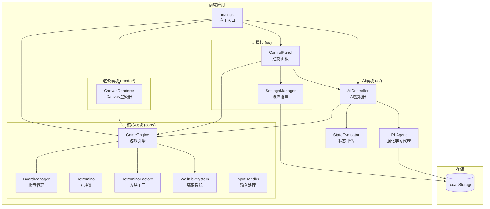

# Tetris AI 游戏架构文档

## 系统概述

Tetris AI 是一个基于 Web 的俄罗斯方块游戏，具有完整的 AI 自动玩功能。系统采用模块化设计，将游戏逻辑、渲染、AI 决策和用户界面分离，便于维护和扩展。

### 项目目标

- 实现经典俄罗斯方块游戏的完整功能
- 提供 AI 自动玩模式，支持强化学习
- 支持可配置的游戏设置（速度、显示选项等）
- 提供流畅的用户体验和响应式界面

## 技术栈

### 核心技术

| 技术 | 用途 | 版本 |
|------|------|------|
| JavaScript (ES6+) | 核心实现语言 | ES2020+ |
| HTML5 Canvas | 游戏渲染 | - |
| CSS3 | 界面样式 | - |
| Local Storage API | 设置和学习数据持久化 | - |

### 开发工具

| 工具 | 用途 |
|------|------|
| Jest | 单元测试和属性测试 |
| fast-check | 属性测试库 |
| JSDoc | API 文档生成 |
| Mermaid | 架构图表 |

## 系统架构概览



## 模块职责概述

### 核心模块 (core/)

| 模块 | 职责 |
|------|------|
| `GameEngine` | 游戏主引擎，管理游戏状态、计分、速度控制 |
| `BoardManager` | 棋盘网格管理，碰撞检测，行消除 |
| `Tetromino` | 方块数据结构，旋转状态管理 |
| `TetrominoFactory` | 方块创建，7-bag 随机算法 |
| `WallKickSystem` | SRS 标准墙踢系统实现 |
| `InputHandler` | 键盘输入处理，按键绑定 |

### AI 模块 (ai/)

| 模块 | 职责 |
|------|------|
| `AIController` | AI 决策控制，移动序列生成 |
| `StateEvaluator` | 棋盘状态评估，特征计算 |
| `RLAgent` | 强化学习代理，epsilon-greedy 策略 |

### 渲染模块 (render/)

| 模块 | 职责 |
|------|------|
| `CanvasRenderer` | Canvas 渲染，动画效果，帧率控制 |

### UI 模块 (ui/)

| 模块 | 职责 |
|------|------|
| `ControlPanel` | 游戏控制界面，按钮和滑块管理 |
| `SettingsManager` | 游戏设置管理，持久化存储 |

## 文档目录

- [组件图](./component-diagram.md) - 详细的组件关系和依赖
- [数据流](./data-flow.md) - 组件间的数据流动
- [序列图](./sequence-diagrams.md) - 关键操作的时序图

## 设计原则

### 1. 单一职责原则

每个模块只负责一个特定的功能领域：
- `BoardManager` 只管理棋盘状态
- `StateEvaluator` 只负责状态评估
- `CanvasRenderer` 只负责渲染

### 2. 依赖注入

组件通过构造函数接收依赖，便于测试和替换：
```javascript
const ai = new AIController(evaluator, rlAgent);
ai.setGameEngine(gameEngine);
```

### 3. 事件驱动

使用回调函数进行组件间通信：
```javascript
const engine = new GameEngine({
    onScoreChange: (score) => updateUI(score),
    onGameOver: () => showGameOver()
});
```

### 4. 配置优于硬编码

游戏参数通过常量和配置对象管理：
```javascript
const SPEED_INTERVALS = { 1: 1000, 2: 900, ... };
const DEFAULT_SETTINGS = { ghostPieceEnabled: true, ... };
```

## 扩展性考虑

系统设计支持以下扩展：

1. **新的方块类型** - 通过扩展 `TETROMINO_SHAPES` 和 `TETROMINO_COLORS`
2. **不同的 AI 策略** - 通过实现新的 `StateEvaluator` 或替换 `RLAgent`
3. **多种渲染方式** - 通过实现新的渲染器替换 `CanvasRenderer`
4. **音效系统** - 预留了 `soundEnabled` 设置项
5. **多人模式** - 模块化设计支持多实例运行

## 相关文档

- [API 文档](../api/) - 详细的 API 参考
- [AI 训练文档](../ai-training/) - AI 系统说明和调优指南
