# 组件图文档

本文档详细描述 Tetris AI 游戏的组件结构和模块间的依赖关系。

## 整体组件架构

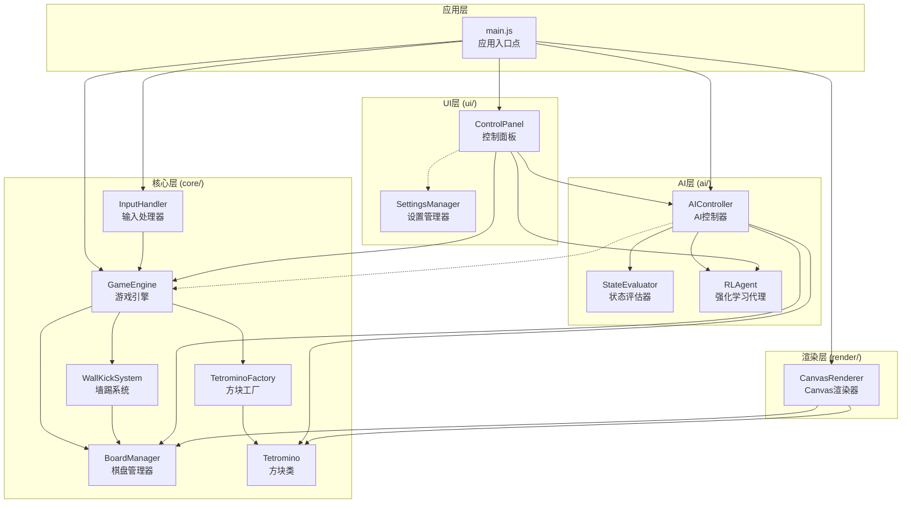

## 核心模块详解

### GameEngine - 游戏引擎

游戏的核心控制器，负责协调所有游戏逻辑。

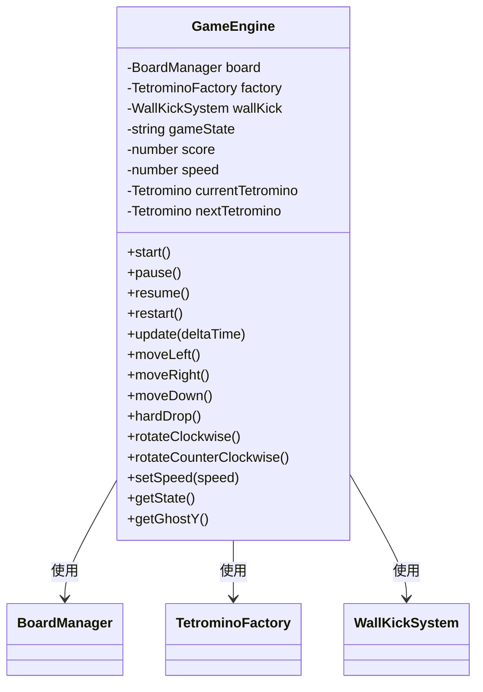

**职责：**
- 游戏生命周期管理（开始、暂停、恢复、重启）
- 游戏状态管理（IDLE、PLAYING、PAUSED、GAMEOVER）
- 方块移动和旋转控制
- 计分系统
- 速度级别管理
- 自动下落逻辑

**实现的需求：**
- Requirements 2.1-2.4: 方块移动控制
- Requirements 3.1-3.2: 方块旋转
- Requirements 4.3-4.7: 计分系统
- Requirements 5.1-5.4: 游戏状态管理

### BoardManager - 棋盘管理器

管理 10x20 的游戏棋盘网格。

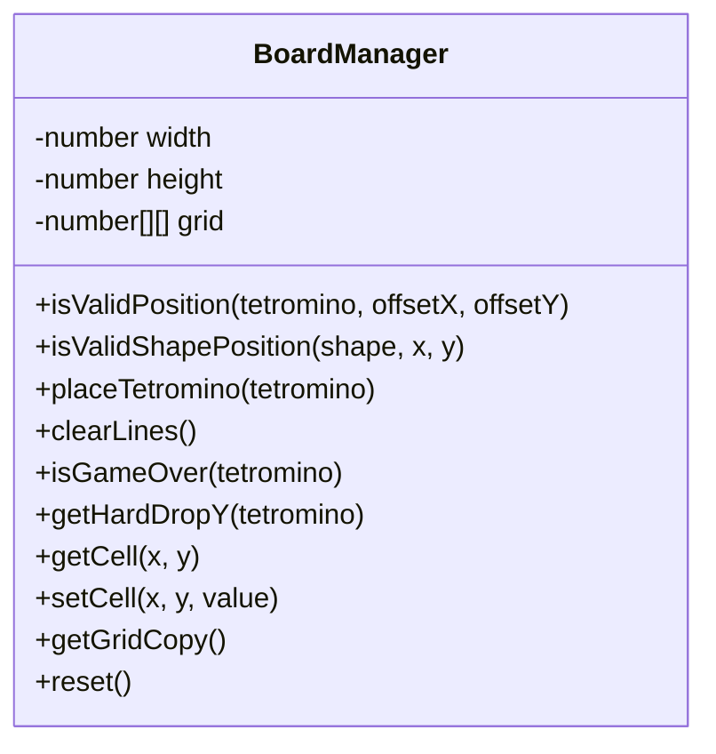

**职责：**
- 棋盘网格状态管理
- 碰撞检测（边界和已放置方块）
- 方块放置
- 完整行检测和消除
- 游戏结束检测
- 硬降位置计算

**实现的需求：**
- Requirements 2.5: 碰撞检测
- Requirements 4.1, 4.2: 行消除
- Requirements 5.1: 游戏结束检测

### Tetromino - 方块类

表示单个俄罗斯方块实例。

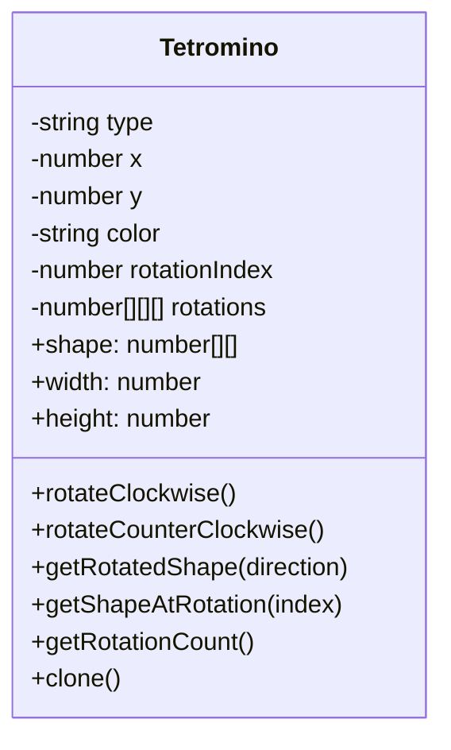

**职责：**
- 方块类型和颜色管理
- 位置坐标管理
- 旋转状态管理
- 预计算的旋转形状访问

**支持的方块类型：**
- I (青色) - 4格直条
- O (黄色) - 2x2正方形
- T (紫色) - T形
- S (绿色) - S形
- Z (红色) - Z形
- J (蓝色) - J形
- L (橙色) - L形

### WallKickSystem - 墙踢系统

实现 SRS (Super Rotation System) 标准的墙踢机制。

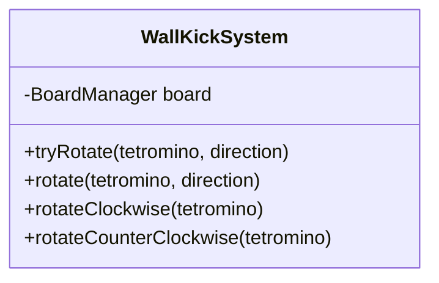

**职责：**
- 处理旋转时的碰撞
- 尝试 SRS 标准的偏移量序列
- 支持顺时针和逆时针旋转

**实现的需求：**
- Requirements 1.1-1.4: 逆时针旋转和墙踢支持

## AI 模块详解

### AIController - AI 控制器

AI 自动玩模式的核心控制器。

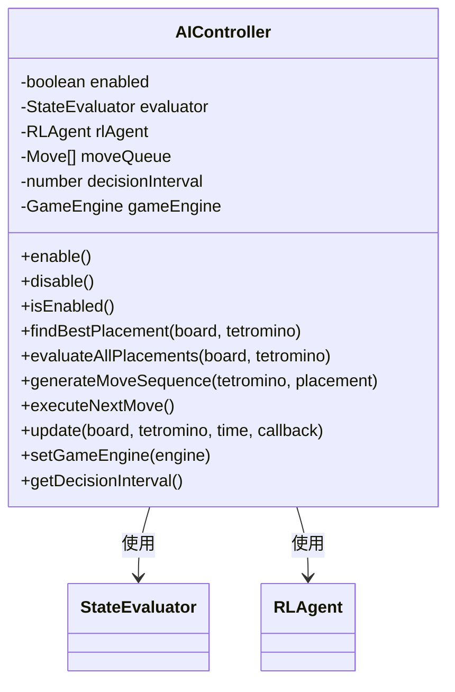

**职责：**
- AI 模式开关控制
- 评估所有可能的放置位置
- 选择最佳放置位置
- 生成移动序列
- 按时间间隔执行移动
- 与游戏速度同步

**实现的需求：**
- Requirements 6.1, 6.4-6.6: AI 控制
- Requirements 2.6: AI 速度一致性

### StateEvaluator - 状态评估器

评估棋盘状态的质量。

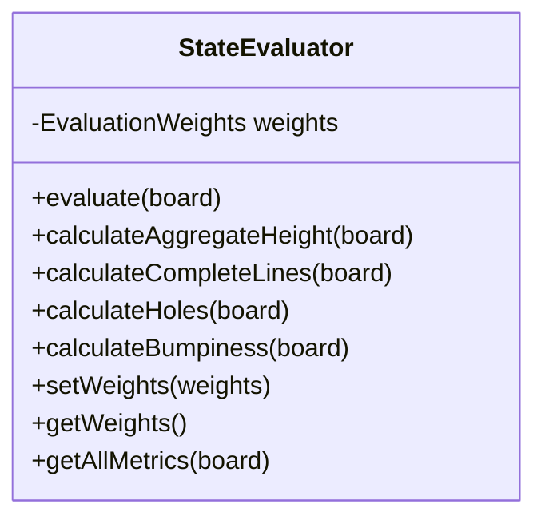

**评估指标：**

| 指标 | 描述 | 默认权重 |
|------|------|----------|
| aggregateHeight | 所有列高度之和 | -0.510066 |
| completeLines | 完整行数 | +0.760666 |
| holes | 空洞数量 | -0.35663 |
| bumpiness | 相邻列高度差之和 | -0.184483 |

### RLAgent - 强化学习代理

实现 epsilon-greedy 策略的强化学习代理。

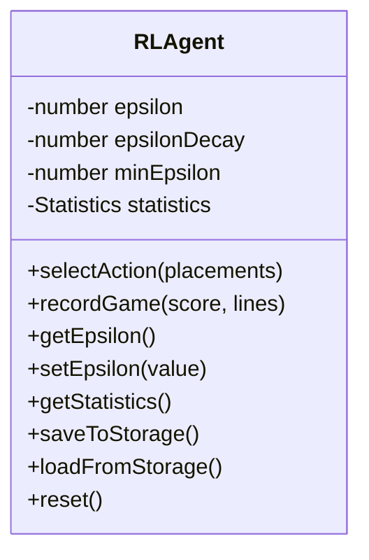

**职责：**
- epsilon-greedy 动作选择
- 游戏统计记录
- 学习数据持久化

## 渲染模块详解

### CanvasRenderer - Canvas 渲染器

基于 HTML5 Canvas 的游戏渲染器。

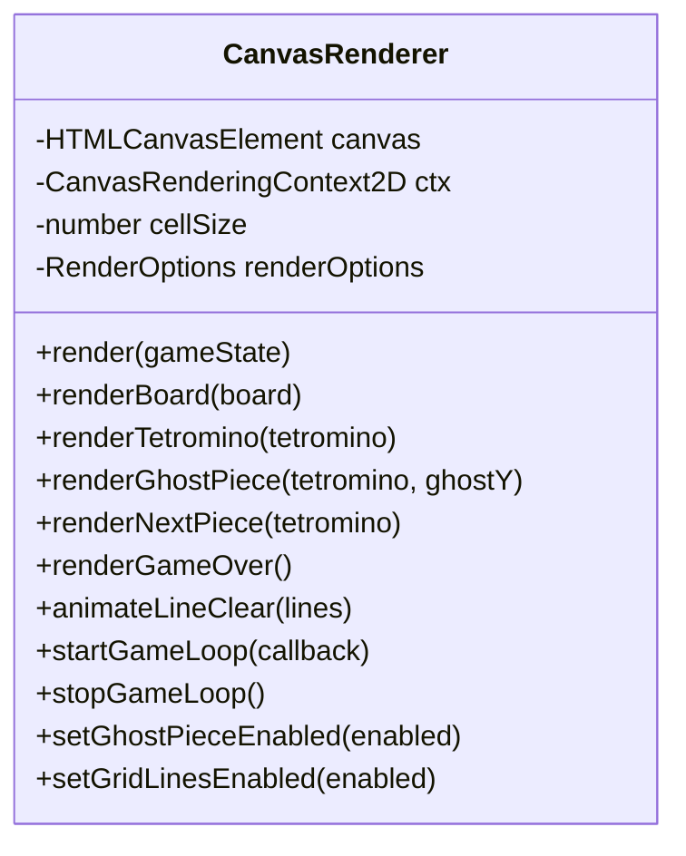

**职责：**
- 棋盘和方块渲染
- Ghost Piece 渲染
- 下一个方块预览
- 网格线渲染
- 行消除动画
- 游戏循环管理
- 帧率控制

**实现的需求：**
- Requirements 3.1, 3.2: Ghost Piece 和网格线开关
- Requirements 10.1-10.3: 渲染功能

## UI 模块详解

### ControlPanel - 控制面板

游戏 UI 控制面板管理器。

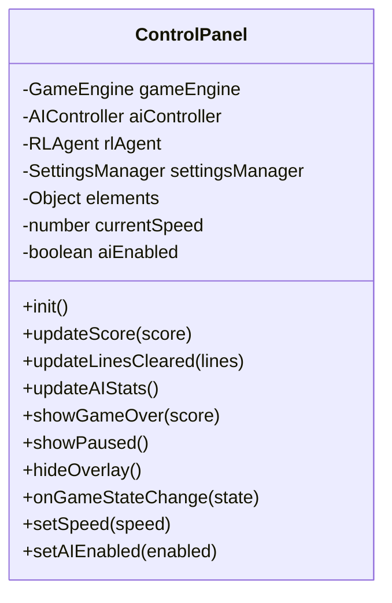

**职责：**
- 游戏控制按钮管理
- AI 模式开关
- 速度滑块控制
- 分数和统计显示
- 游戏状态覆盖层

### SettingsManager - 设置管理器

游戏设置的管理和持久化。

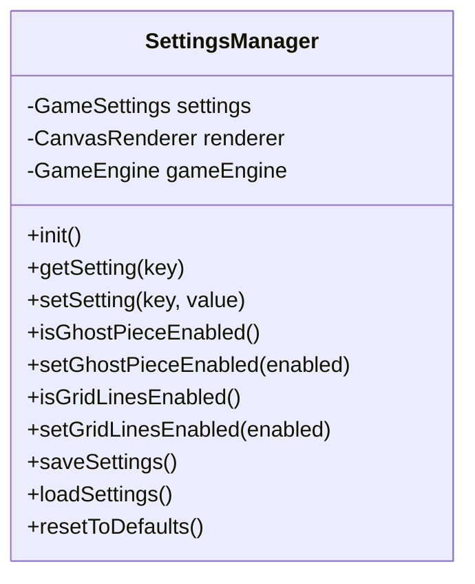

**职责：**
- 游戏设置管理
- Local Storage 持久化
- 设置变更即时应用

**实现的需求：**
- Requirements 3.1-3.7: 游戏设置选项

## 模块依赖关系总结

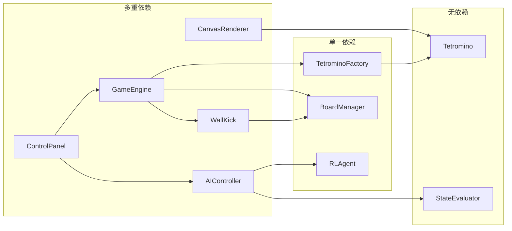

## 接口契约

### 游戏状态接口

```typescript
interface GameState {
    gameState: 'idle' | 'playing' | 'paused' | 'gameover';
    score: number;
    level: number;
    linesCleared: number;
    speed: number;
    currentTetromino: Tetromino | null;
    nextTetromino: Tetromino | null;
    board: number[][];
    ghostY?: number;
}
```

### 放置位置接口

```typescript
interface Placement {
    x: number;           // 目标X坐标
    rotation: number;    // 目标旋转状态
    score: number;       // 评估分数
    y?: number;          // 目标Y坐标
}
```

### 移动指令接口

```typescript
interface Move {
    type: 'left' | 'right' | 'down' | 'rotate' | 'drop';
}
```

### 渲染选项接口

```typescript
interface RenderOptions {
    ghostPieceEnabled: boolean;
    gridLinesEnabled: boolean;
    gridLineColor: string;
    gridLineWidth: number;
}
```
