# 数据流文档

本文档描述 Tetris AI 游戏中各组件之间的数据流动。

## 整体数据流概览

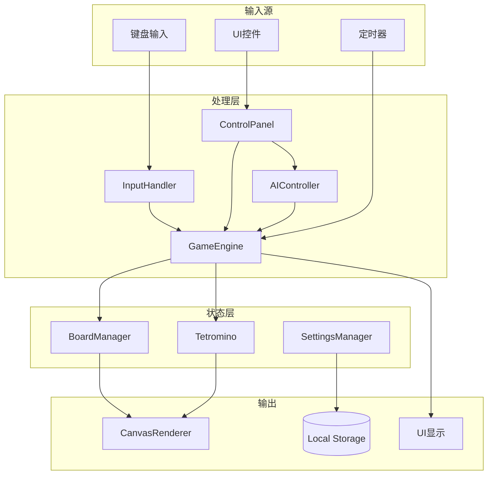
```mermaid
flowchart TB
    subgraph Input["输入源"]
        Keyboard[键盘输入]
        UIControls[UI控件]
        Timer[定时器]
    end
    
    subgraph Processing["处理层"]
        InputHandler[InputHandler]
        ControlPanel[ControlPanel]
        GameEngine[GameEngine]
        AIController[AIController]
    end
    
    subgraph State["状态层"]
        BoardManager[BoardManager]
        Tetromino[Tetromino]
        Settings[SettingsManager]
    end
    
    subgraph Output["输出"]
        CanvasRenderer[CanvasRenderer]
        UIDisplay[UI显示]
        LocalStorage[(Local Storage)]
    end
    
    Keyboard --> InputHandler
    UIControls --> ControlPanel
    Timer --> GameEngine
    
    InputHandler --> GameEngine
    ControlPanel --> GameEngine
    ControlPanel --> AIController
    
    GameEngine --> BoardManager
    GameEngine --> Tetromino
    AIController --> GameEngine
    
    BoardManager --> CanvasRenderer
    Tetromino --> CanvasRenderer
    GameEngine --> UIDisplay
    Settings --> LocalStorage
```

## 游戏主循环数据流

游戏主循环是系统的核心数据流，每帧执行一次。

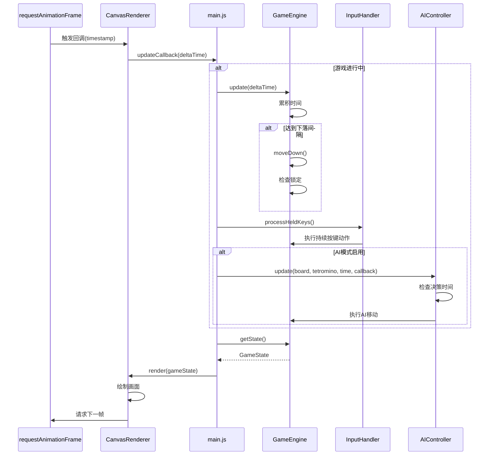
```mermaid
sequenceDiagram
    participant RAF as requestAnimationFrame
    participant Renderer as CanvasRenderer
    participant Main as main.js
    participant Engine as GameEngine
    participant Input as InputHandler
    participant AI as AIController
    
    RAF->>Renderer: 触发回调(timestamp)
    Renderer->>Main: updateCallback(deltaTime)
    
    alt 游戏进行中
        Main->>Engine: update(deltaTime)
        Engine->>Engine: 累积时间
        
        alt 达到下落间隔
            Engine->>Engine: moveDown()
            Engine->>Engine: 检查锁定
        end
        
        Main->>Input: processHeldKeys()
        Input->>Engine: 执行持续按键动作
        
        alt AI模式启用
            Main->>AI: update(board, tetromino, time, callback)
            AI->>AI: 检查决策时间
            AI->>Engine: 执行AI移动
        end
    end
    
    Main->>Engine: getState()
    Engine-->>Main: GameState
    Main->>Renderer: render(gameState)
    Renderer->>Renderer: 绘制画面
    
    Renderer->>RAF: 请求下一帧
```

## 用户输入数据流

### 键盘输入流程

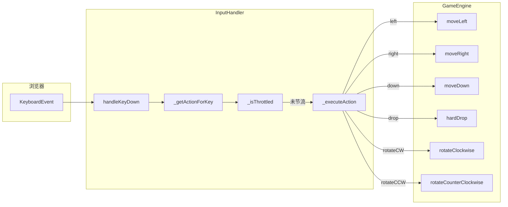
```mermaid
flowchart LR
    subgraph Browser["浏览器"]
        KeyEvent[KeyboardEvent]
    end
    
    subgraph InputHandler["InputHandler"]
        HandleKeyDown[handleKeyDown]
        GetAction[_getActionForKey]
        CheckThrottle[_isThrottled]
        ExecuteAction[_executeAction]
    end
    
    subgraph GameEngine["GameEngine"]
        MoveLeft[moveLeft]
        MoveRight[moveRight]
        MoveDown[moveDown]
        HardDrop[hardDrop]
        RotateCW[rotateClockwise]
        RotateCCW[rotateCounterClockwise]
    end
    
    KeyEvent --> HandleKeyDown
    HandleKeyDown --> GetAction
    GetAction --> CheckThrottle
    CheckThrottle -->|未节流| ExecuteAction
    
    ExecuteAction -->|left| MoveLeft
    ExecuteAction -->|right| MoveRight
    ExecuteAction -->|down| MoveDown
    ExecuteAction -->|drop| HardDrop
    ExecuteAction -->|rotateCW| RotateCW
    ExecuteAction -->|rotateCCW| RotateCCW
```

### 按键映射表

| 按键 | 动作 | 游戏引擎方法 |
|------|------|--------------|
| ← (ArrowLeft) | left | moveLeft() |
| → (ArrowRight) | right | moveRight() |
| ↓ (ArrowDown) | down | moveDown() |
| Space | drop | hardDrop() |
| ↑ (ArrowUp) | rotateCW | rotateClockwise() |
| Z | rotateCCW | rotateCounterClockwise() |

## 方块移动数据流

### 普通移动（左/右/下）

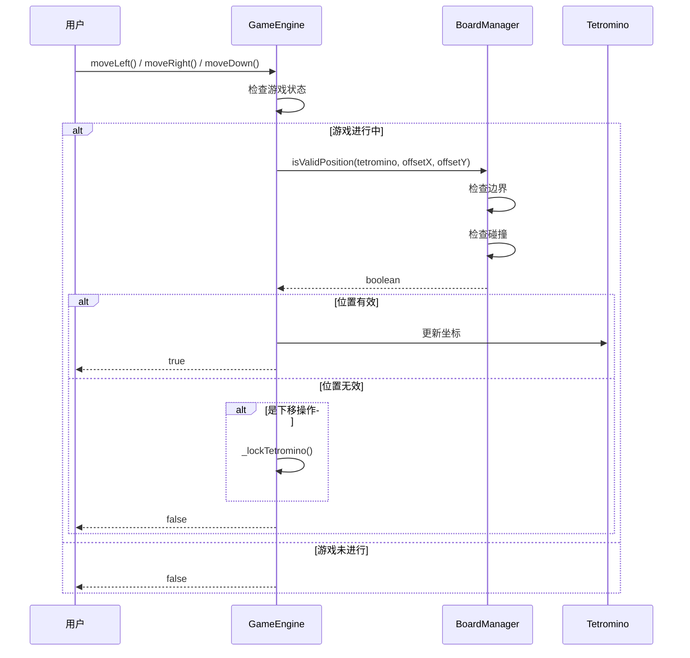
```mermaid
sequenceDiagram
    participant User as 用户
    participant Engine as GameEngine
    participant Board as BoardManager
    participant Tetromino as Tetromino
    
    User->>Engine: moveLeft() / moveRight() / moveDown()
    Engine->>Engine: 检查游戏状态
    
    alt 游戏进行中
        Engine->>Board: isValidPosition(tetromino, offsetX, offsetY)
        Board->>Board: 检查边界
        Board->>Board: 检查碰撞
        Board-->>Engine: boolean
        
        alt 位置有效
            Engine->>Tetromino: 更新坐标
            Engine-->>User: true
        else 位置无效
            alt 是下移操作
                Engine->>Engine: _lockTetromino()
            end
            Engine-->>User: false
        end
    else 游戏未进行
        Engine-->>User: false
    end
```

### 硬降数据流

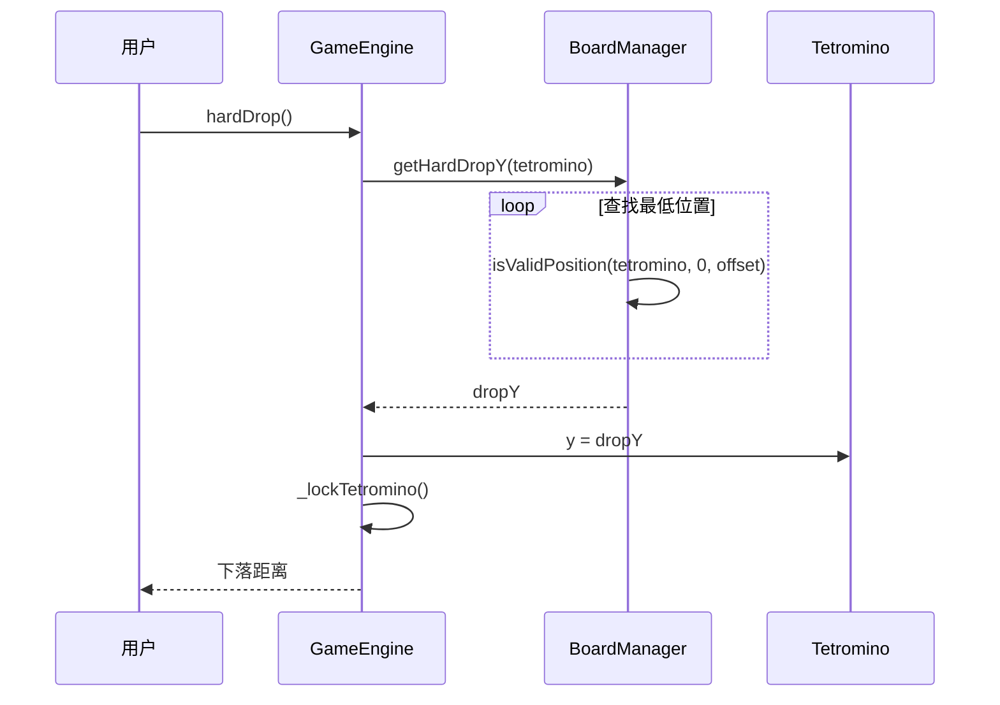
```mermaid
sequenceDiagram
    participant User as 用户
    participant Engine as GameEngine
    participant Board as BoardManager
    participant Tetromino as Tetromino
    
    User->>Engine: hardDrop()
    Engine->>Board: getHardDropY(tetromino)
    
    loop 查找最低位置
        Board->>Board: isValidPosition(tetromino, 0, offset)
    end
    
    Board-->>Engine: dropY
    Engine->>Tetromino: y = dropY
    Engine->>Engine: _lockTetromino()
    Engine-->>User: 下落距离
```

## 旋转数据流

### 带墙踢的旋转流程

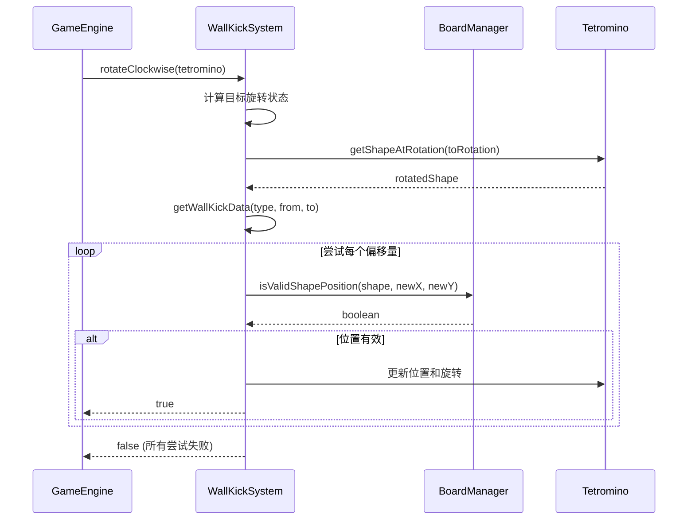
```mermaid
sequenceDiagram
    participant Engine as GameEngine
    participant WallKick as WallKickSystem
    participant Board as BoardManager
    participant Tetromino as Tetromino
    
    Engine->>WallKick: rotateClockwise(tetromino)
    WallKick->>WallKick: 计算目标旋转状态
    WallKick->>Tetromino: getShapeAtRotation(toRotation)
    Tetromino-->>WallKick: rotatedShape
    
    WallKick->>WallKick: getWallKickData(type, from, to)
    
    loop 尝试每个偏移量
        WallKick->>Board: isValidShapePosition(shape, newX, newY)
        Board-->>WallKick: boolean
        
        alt 位置有效
            WallKick->>Tetromino: 更新位置和旋转
            WallKick-->>Engine: true
        end
    end
    
    WallKick-->>Engine: false (所有尝试失败)
```

### 墙踢偏移量数据

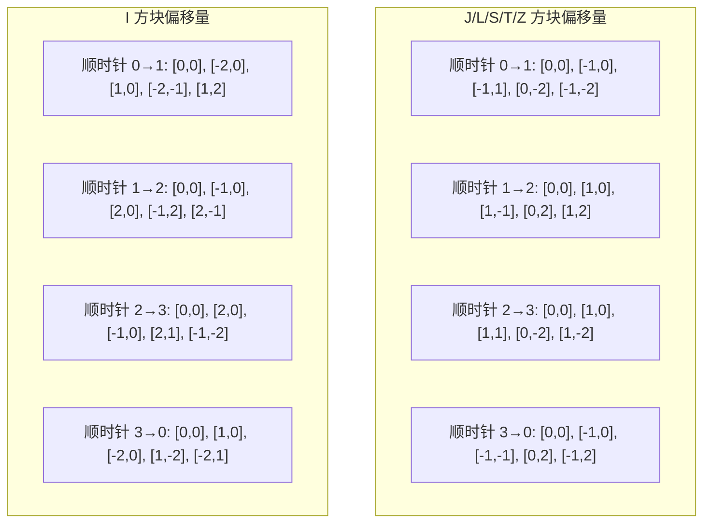
```mermaid
flowchart TB
    subgraph JLSTZ["J/L/S/T/Z 方块偏移量"]
        CW1["顺时针 0→1: [0,0], [-1,0], [-1,1], [0,-2], [-1,-2]"]
        CW2["顺时针 1→2: [0,0], [1,0], [1,-1], [0,2], [1,2]"]
        CW3["顺时针 2→3: [0,0], [1,0], [1,1], [0,-2], [1,-2]"]
        CW4["顺时针 3→0: [0,0], [-1,0], [-1,-1], [0,2], [-1,2]"]
    end
    
    subgraph I["I 方块偏移量"]
        ICW1["顺时针 0→1: [0,0], [-2,0], [1,0], [-2,-1], [1,2]"]
        ICW2["顺时针 1→2: [0,0], [-1,0], [2,0], [-1,2], [2,-1]"]
        ICW3["顺时针 2→3: [0,0], [2,0], [-1,0], [2,1], [-1,-2]"]
        ICW4["顺时针 3→0: [0,0], [1,0], [-2,0], [1,-2], [-2,1]"]
    end
```

## 行消除数据流

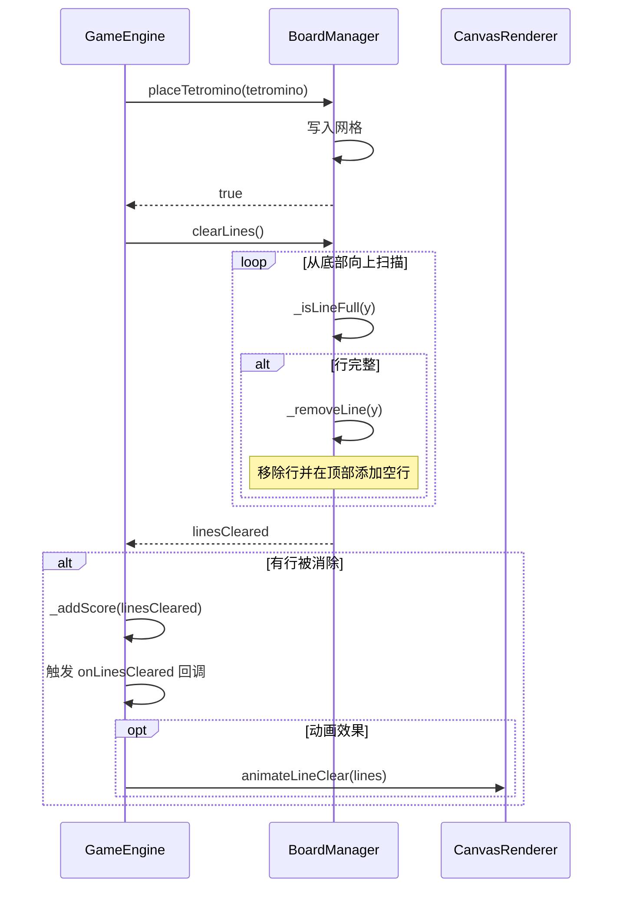
```mermaid
sequenceDiagram
    participant Engine as GameEngine
    participant Board as BoardManager
    participant Renderer as CanvasRenderer
    
    Engine->>Board: placeTetromino(tetromino)
    Board->>Board: 写入网格
    Board-->>Engine: true
    
    Engine->>Board: clearLines()
    
    loop 从底部向上扫描
        Board->>Board: _isLineFull(y)
        
        alt 行完整
            Board->>Board: _removeLine(y)
            Note over Board: 移除行并在顶部添加空行
        end
    end
    
    Board-->>Engine: linesCleared
    
    alt 有行被消除
        Engine->>Engine: _addScore(linesCleared)
        Engine->>Engine: 触发 onLinesCleared 回调
        
        opt 动画效果
            Engine->>Renderer: animateLineClear(lines)
        end
    end
```

### 计分规则数据

| 消除行数 | 得分 |
|----------|------|
| 1 行 | 100 |
| 2 行 | 300 |
| 3 行 | 500 |
| 4 行 (Tetris) | 800 |

## AI 决策数据流

### AI 决策流程

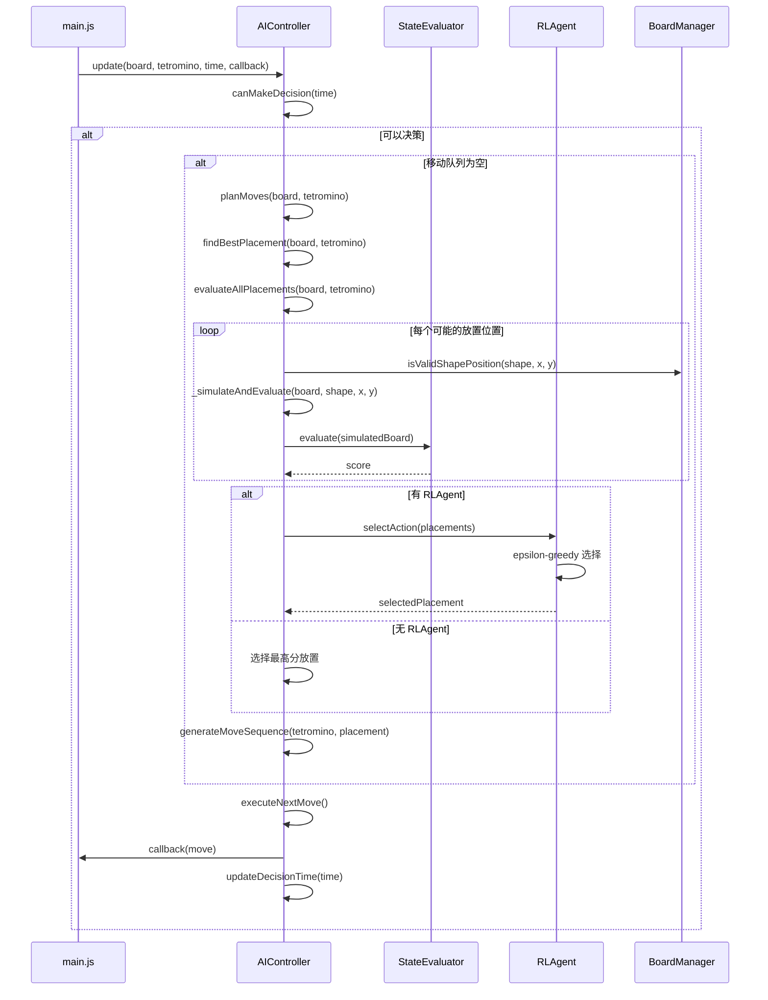
```mermaid
sequenceDiagram
    participant Main as main.js
    participant AI as AIController
    participant Eval as StateEvaluator
    participant RL as RLAgent
    participant Board as BoardManager
    
    Main->>AI: update(board, tetromino, time, callback)
    AI->>AI: canMakeDecision(time)
    
    alt 可以决策
        alt 移动队列为空
            AI->>AI: planMoves(board, tetromino)
            AI->>AI: findBestPlacement(board, tetromino)
            AI->>AI: evaluateAllPlacements(board, tetromino)
            
            loop 每个可能的放置位置
                AI->>Board: isValidShapePosition(shape, x, y)
                AI->>AI: _simulateAndEvaluate(board, shape, x, y)
                AI->>Eval: evaluate(simulatedBoard)
                Eval-->>AI: score
            end
            
            alt 有 RLAgent
                AI->>RL: selectAction(placements)
                RL->>RL: epsilon-greedy 选择
                RL-->>AI: selectedPlacement
            else 无 RLAgent
                AI->>AI: 选择最高分放置
            end
            
            AI->>AI: generateMoveSequence(tetromino, placement)
        end
        
        AI->>AI: executeNextMove()
        AI->>Main: callback(move)
        AI->>AI: updateDecisionTime(time)
    end
```

### 状态评估数据流

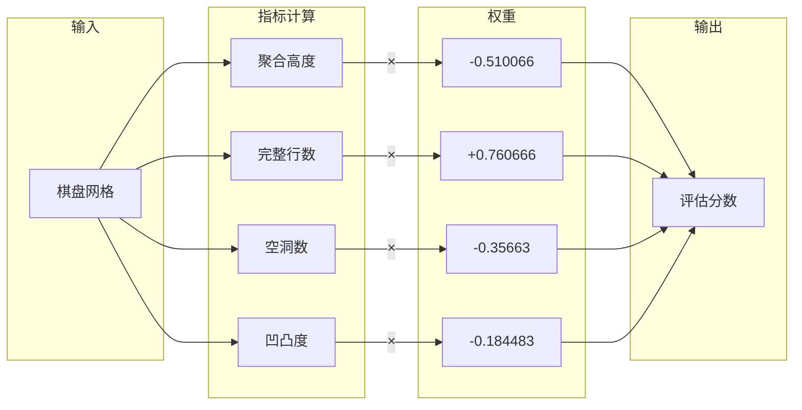
```mermaid
flowchart LR
    subgraph Input["输入"]
        Board[棋盘网格]
    end
    
    subgraph Metrics["指标计算"]
        Height[聚合高度]
        Lines[完整行数]
        Holes[空洞数]
        Bump[凹凸度]
    end
    
    subgraph Weights["权重"]
        W1["-0.510066"]
        W2["+0.760666"]
        W3["-0.35663"]
        W4["-0.184483"]
    end
    
    subgraph Output["输出"]
        Score[评估分数]
    end
    
    Board --> Height
    Board --> Lines
    Board --> Holes
    Board --> Bump
    
    Height --> |×| W1
    Lines --> |×| W2
    Holes --> |×| W3
    Bump --> |×| W4
    
    W1 --> Score
    W2 --> Score
    W3 --> Score
    W4 --> Score
```

## 设置数据流

### 设置变更流程

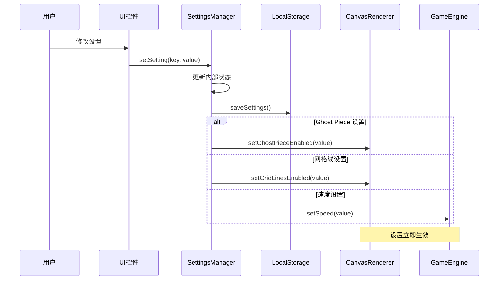
```mermaid
sequenceDiagram
    participant User as 用户
    participant UI as UI控件
    participant Settings as SettingsManager
    participant Storage as LocalStorage
    participant Renderer as CanvasRenderer
    participant Engine as GameEngine
    
    User->>UI: 修改设置
    UI->>Settings: setSetting(key, value)
    Settings->>Settings: 更新内部状态
    Settings->>Storage: saveSettings()
    
    alt Ghost Piece 设置
        Settings->>Renderer: setGhostPieceEnabled(value)
    else 网格线设置
        Settings->>Renderer: setGridLinesEnabled(value)
    else 速度设置
        Settings->>Engine: setSpeed(value)
    end
    
    Note over Renderer,Engine: 设置立即生效
```

### 设置加载流程

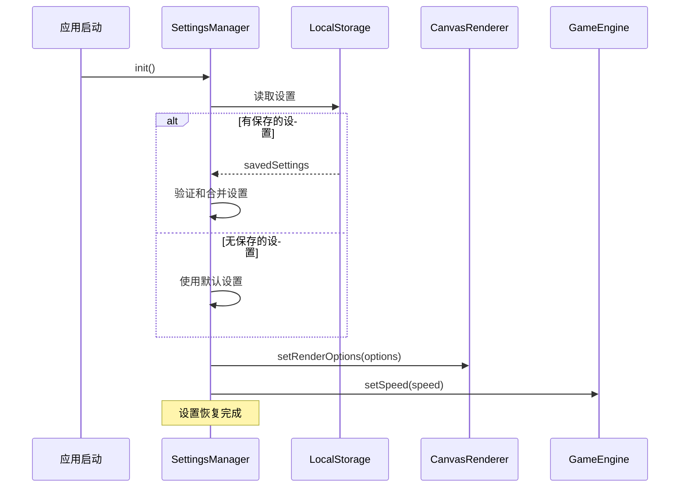
```mermaid
sequenceDiagram
    participant App as 应用启动
    participant Settings as SettingsManager
    participant Storage as LocalStorage
    participant Renderer as CanvasRenderer
    participant Engine as GameEngine
    
    App->>Settings: init()
    Settings->>Storage: 读取设置
    
    alt 有保存的设置
        Storage-->>Settings: savedSettings
        Settings->>Settings: 验证和合并设置
    else 无保存的设置
        Settings->>Settings: 使用默认设置
    end
    
    Settings->>Renderer: setRenderOptions(options)
    Settings->>Engine: setSpeed(speed)
    
    Note over Settings: 设置恢复完成
```

## 游戏状态数据流

### 状态转换图

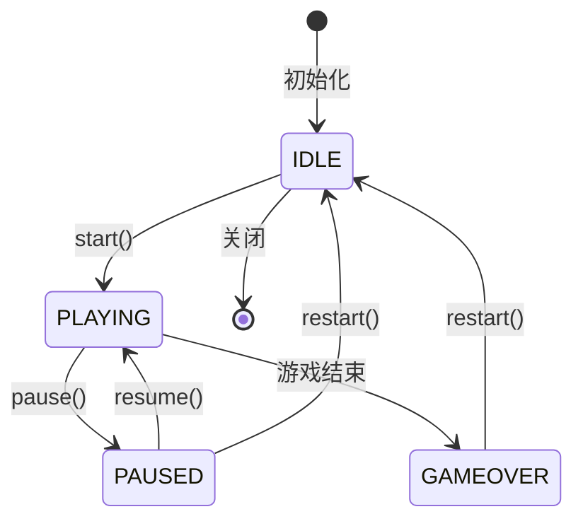
```mermaid
stateDiagram-v2
    [*] --> IDLE: 初始化
    IDLE --> PLAYING: start()
    PLAYING --> PAUSED: pause()
    PAUSED --> PLAYING: resume()
    PLAYING --> GAMEOVER: 游戏结束
    GAMEOVER --> IDLE: restart()
    PAUSED --> IDLE: restart()
    IDLE --> [*]: 关闭
```

### 状态变化通知流程

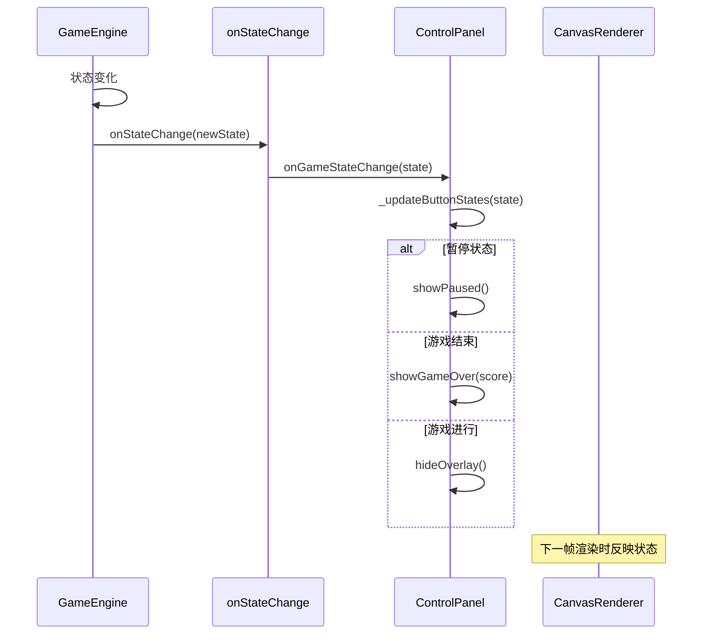
```mermaid
sequenceDiagram
    participant Engine as GameEngine
    participant Callback as onStateChange
    participant Panel as ControlPanel
    participant Renderer as CanvasRenderer
    
    Engine->>Engine: 状态变化
    Engine->>Callback: onStateChange(newState)
    Callback->>Panel: onGameStateChange(state)
    Panel->>Panel: _updateButtonStates(state)
    
    alt 暂停状态
        Panel->>Panel: showPaused()
    else 游戏结束
        Panel->>Panel: showGameOver(score)
    else 游戏进行
        Panel->>Panel: hideOverlay()
    end
    
    Note over Renderer: 下一帧渲染时反映状态
```

## 数据持久化流程

### AI 学习数据持久化

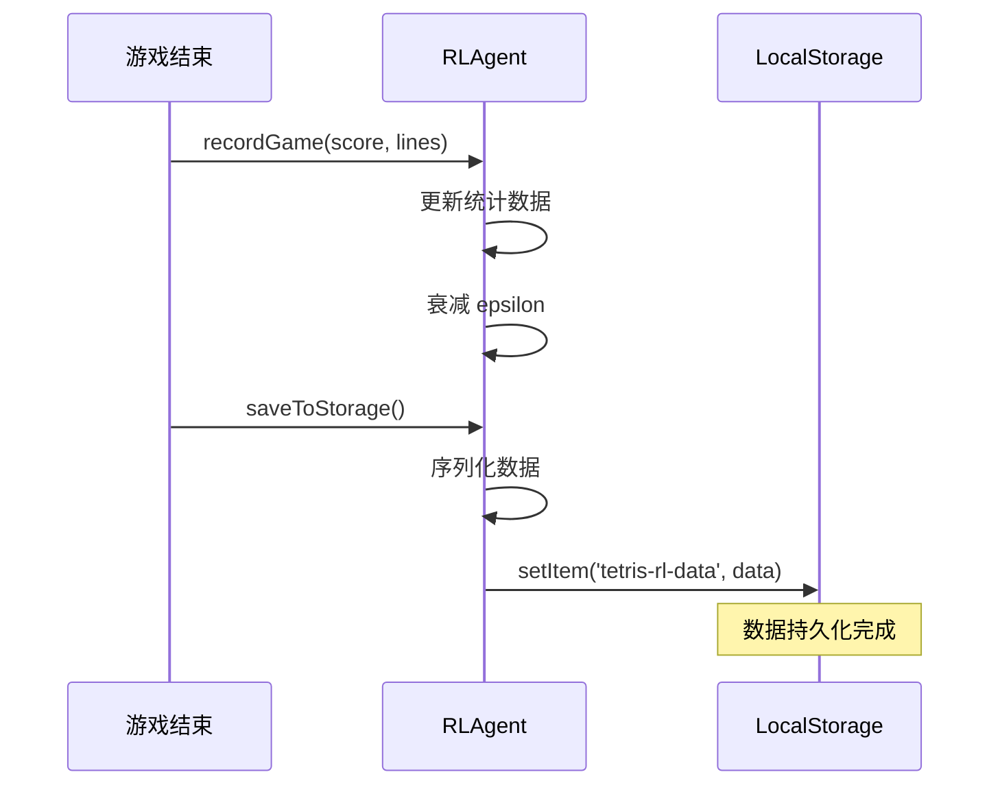
```mermaid
sequenceDiagram
    participant Game as 游戏结束
    participant RL as RLAgent
    participant Storage as LocalStorage
    
    Game->>RL: recordGame(score, lines)
    RL->>RL: 更新统计数据
    RL->>RL: 衰减 epsilon
    
    Game->>RL: saveToStorage()
    RL->>RL: 序列化数据
    RL->>Storage: setItem('tetris-rl-data', data)
    
    Note over Storage: 数据持久化完成
```

### 设置持久化

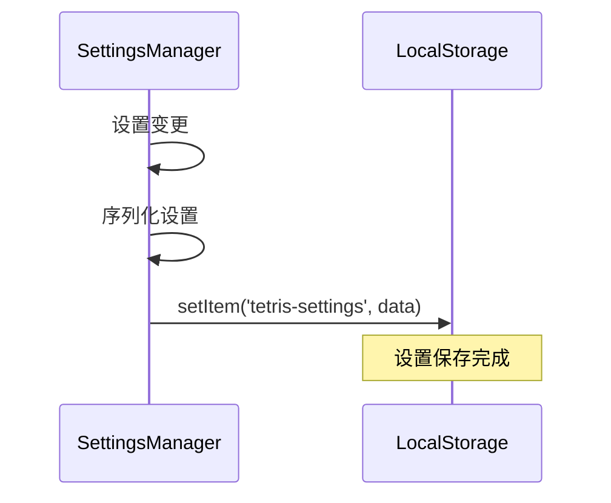
```mermaid
sequenceDiagram
    participant Settings as SettingsManager
    participant Storage as LocalStorage
    
    Settings->>Settings: 设置变更
    Settings->>Settings: 序列化设置
    Settings->>Storage: setItem('tetris-settings', data)
    
    Note over Storage: 设置保存完成
```

## 数据格式

### 游戏状态数据格式

```javascript
{
    gameState: 'playing',      // 游戏状态
    score: 1200,               // 当前分数
    level: 1,                  // 当前等级
    linesCleared: 12,          // 已消除行数
    speed: 5,                  // 速度级别
    currentTetromino: {...},   // 当前方块
    nextTetromino: {...},      // 下一个方块
    board: [[0,0,...], ...]    // 棋盘网格
}
```

### 设置数据格式

```javascript
{
    version: '1.0.0',
    display: {
        ghostPieceEnabled: true,
        gridLinesEnabled: true
    },
    gameplay: {
        speed: 5
    },
    audio: {
        soundEnabled: false
    }
}
```

### AI 学习数据格式

```javascript
{
    epsilon: 0.1,
    statistics: {
        gamesPlayed: 100,
        bestScore: 5000,
        totalScore: 150000,
        totalLinesCleared: 500
    }
}
```
