# 序列图文档

本文档包含 Tetris AI 游戏关键操作的序列图，帮助理解系统的运行时行为。

## 1. 游戏循环序列图

游戏循环是系统的核心，每帧执行一次，负责更新游戏状态和渲染画面。

### 1.1 完整游戏循环

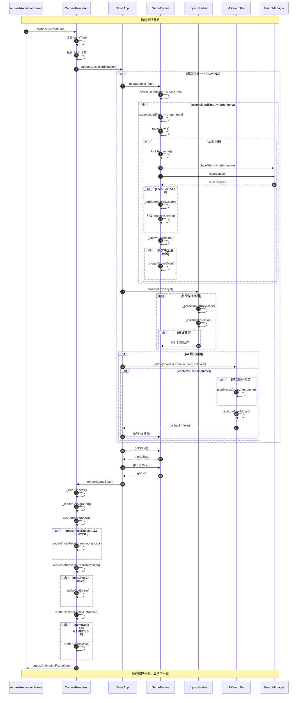

### 1.2 简化的游戏循环流程

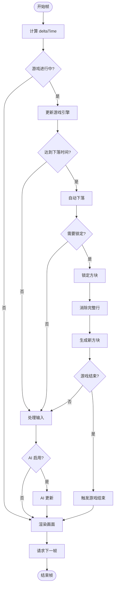

## 2. AI 决策序列图

AI 决策过程包括位置评估、最佳位置选择和移动序列生成。

### 2.1 完整 AI 决策流程

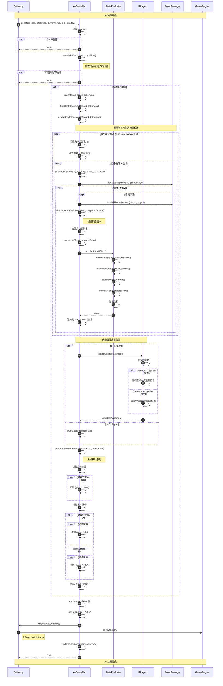

### 2.2 状态评估详细流程

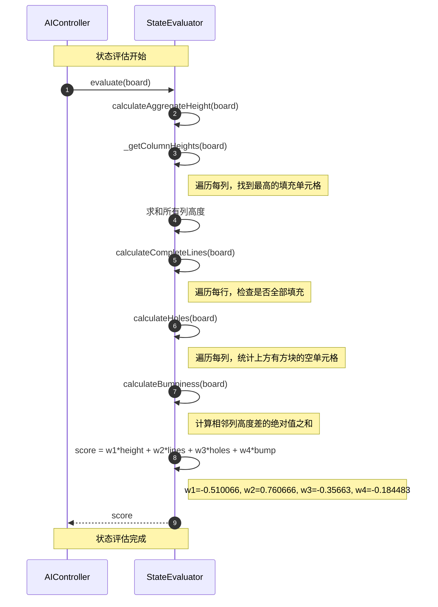

## 3. 行消除序列图

行消除是游戏的核心机制之一，包括检测、消除和计分。

### 3.1 完整行消除流程

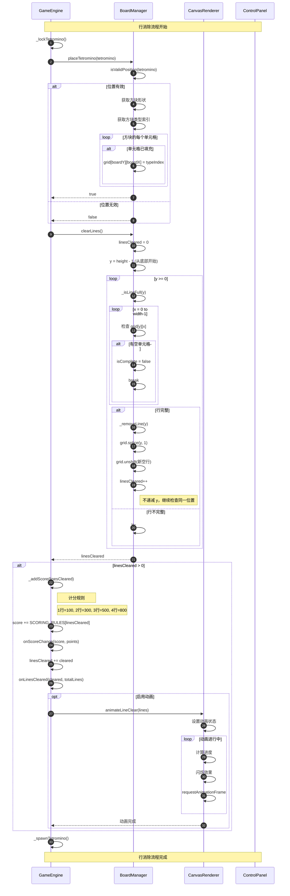

### 3.2 行消除算法可视化

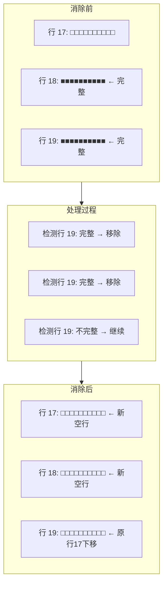

## 4. 游戏启动序列图

### 4.1 应用初始化流程

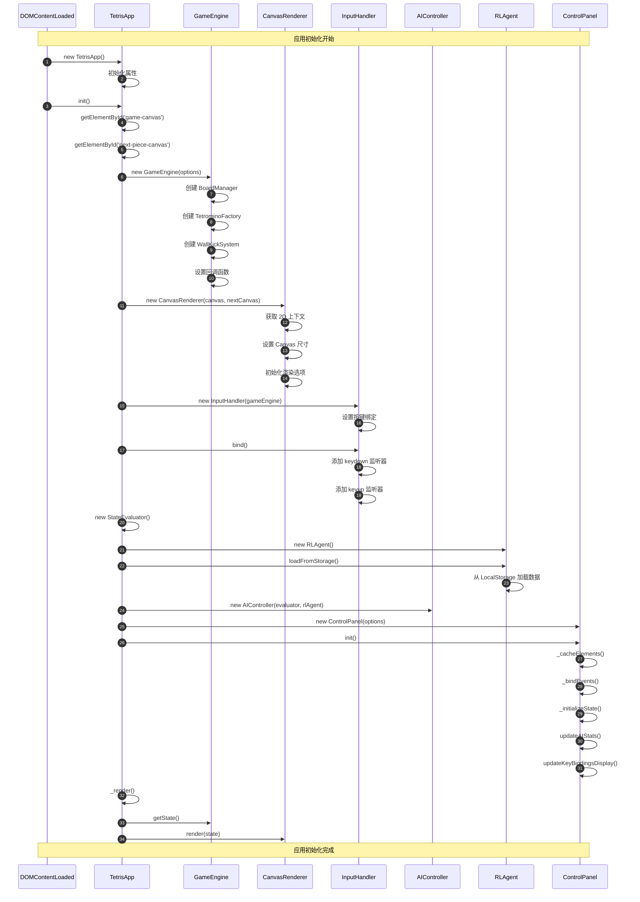

### 4.2 游戏开始流程

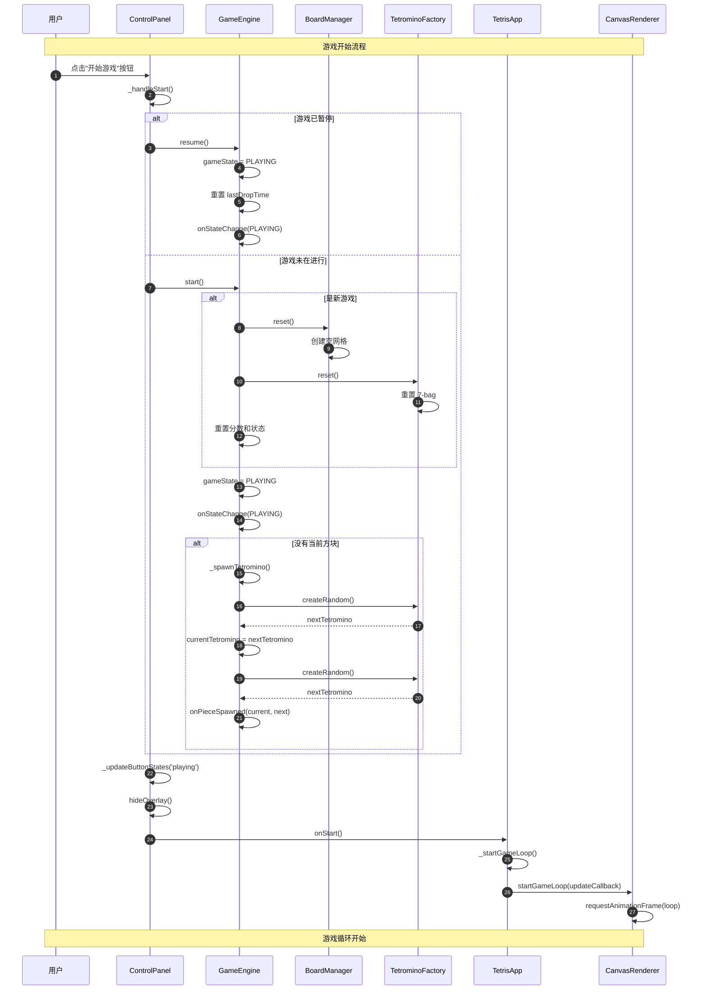

## 5. 方块旋转序列图

### 5.1 带墙踢的旋转流程

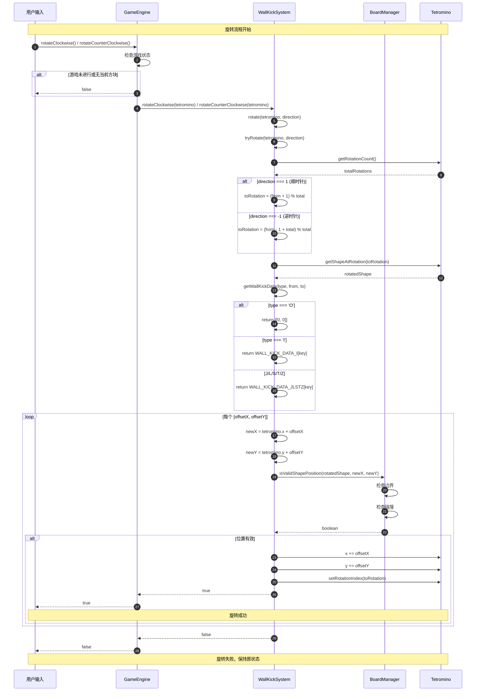

### 5.2 旋转状态转换图

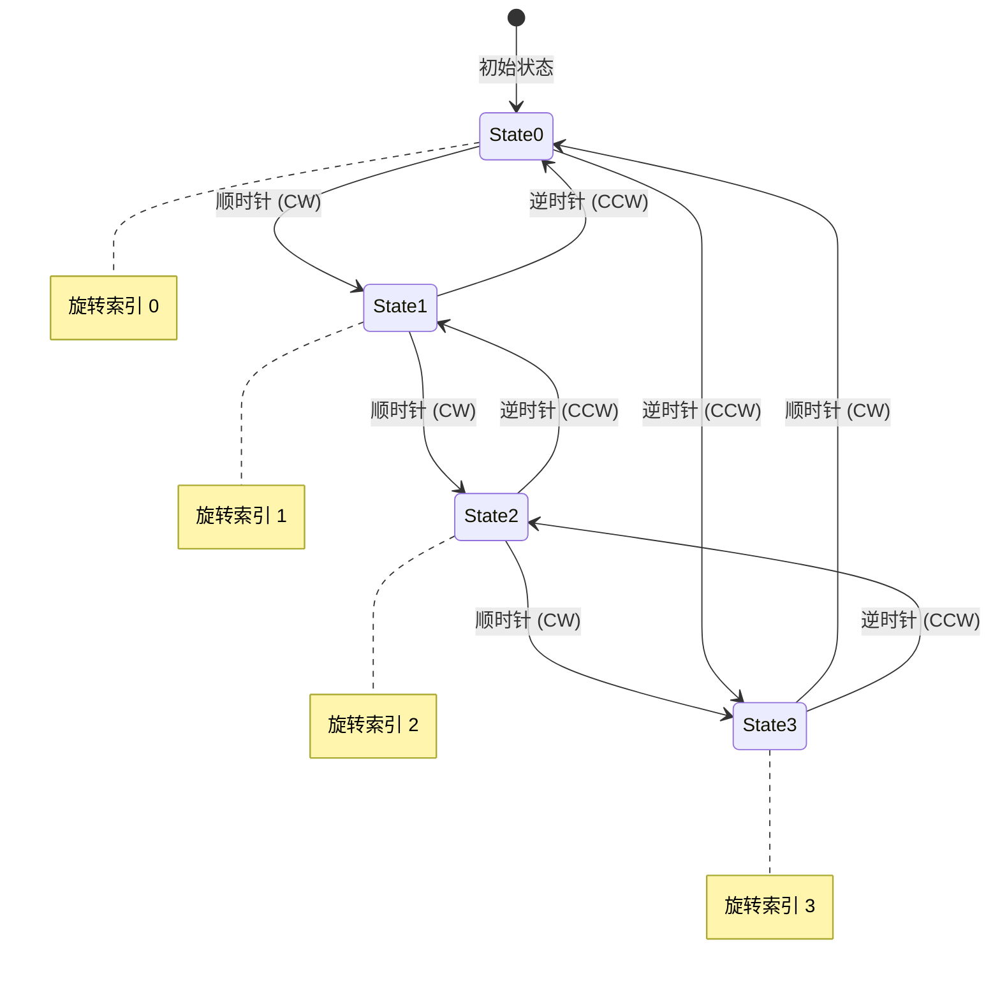

## 6. 设置变更序列图

### 6.1 设置即时应用流程

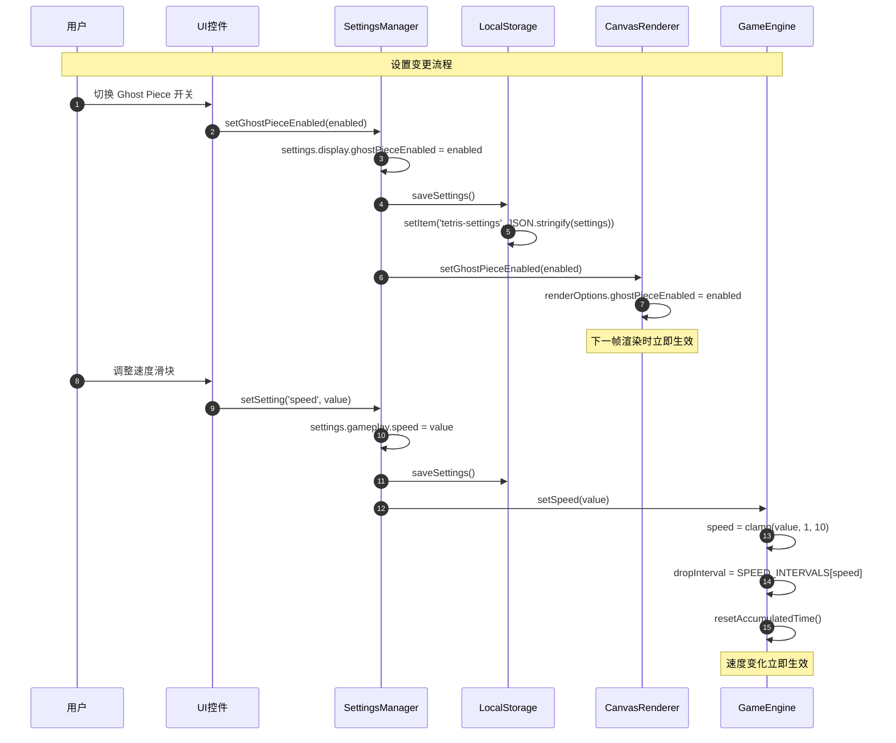

## 7. 游戏结束序列图

### 7.1 游戏结束流程

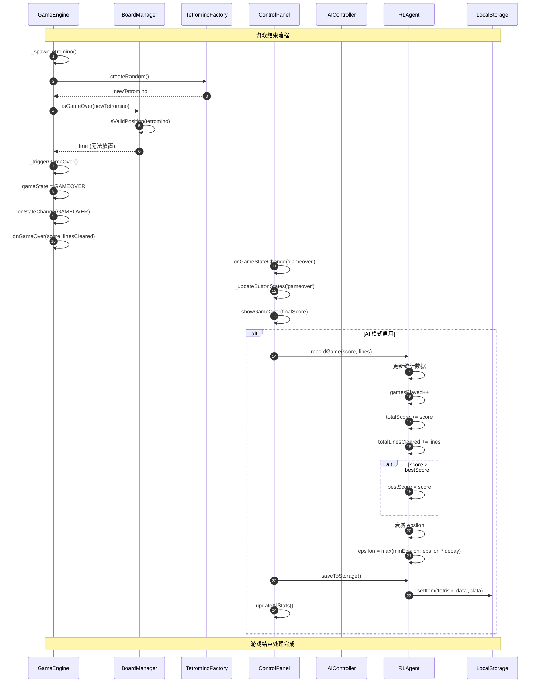

## 总结

本文档涵盖了 Tetris AI 游戏的主要操作序列：

1. **游戏循环** - 系统的核心，每帧执行更新和渲染
2. **AI 决策** - 评估所有放置位置并选择最佳策略
3. **行消除** - 检测、消除完整行并计分
4. **游戏启动** - 应用初始化和游戏开始流程
5. **方块旋转** - 带墙踢机制的旋转处理
6. **设置变更** - 设置的即时应用和持久化
7. **游戏结束** - 游戏结束检测和数据保存

这些序列图帮助开发者理解系统的运行时行为，便于调试和扩展功能。
